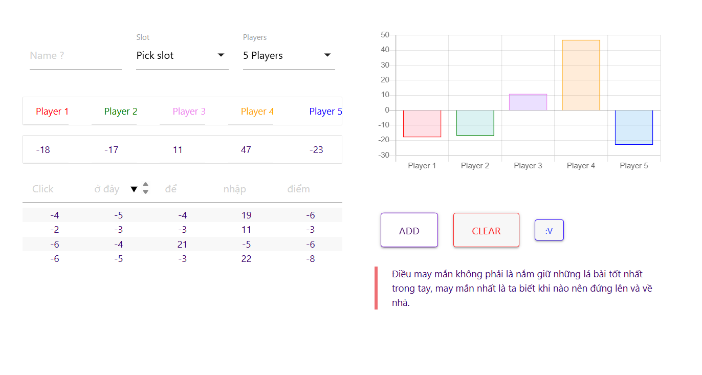

# Sâm Lốc Score Calculator

## Overview

This web app helps players keep track of scores during Sâm. It supports 2-5 players and provides an easy-to-use interface for entering scores and viewing results.

## Features

- **Multiplayer Support**: Play with 2, 3, 4, or 5 players
- **Score Tracking**: Enter scores for each player and round
- **Visual Charts**: See score progression with interactive charts
- **Responsive Design**: Works on desktop and mobile devices
- **Audio Feedback**: Sound effects for actions

## How to Use

1. Enter player names in the input field
2. Select a slot for each player
3. Choose the number of players (2-5)
4. Enter scores for each player after each round
5. Click "ADD" to record the scores
6. View the score chart to see progress

## Technical Details

- Built with HTML, CSS, and JavaScript
- Uses Materialize CSS framework for styling
- Chart.js for data visualization
- Responsive design for all screen sizes

## Installation

No installation required! Simply open this link `https://tungtt30.github.io/sam2.0/`.
